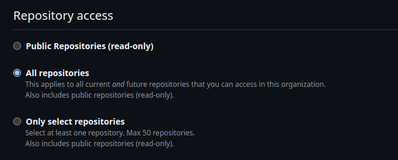

# `labels` Terraform plan

This is a Terraform plan for managing labels in the Charmed HPC GitHub organization using the
GitHub Terraform provider. For more information, refer to the
[documentation](https://registry.terraform.io/providers/integrations/github/latest/docs)
for the GitHub Terraform provider.

## Requirements

This plan requires that you have a GitHub Personal Access Token (PAT) that grants organization-wide
permissions to edit issue and pull request labels. Refer to the [usage](#usage) section for more details.

## Managed organization repositories

Below is the list of Charmed HPC organization repositories whose labels are managed by the
`labels` Terraform plan:

* .github
* docs
* charmed-hpc-terraform
* hpc-libs
* slurm-charms
* slurm-snap
* slurmutils
* filesystem-charms
* ondemand-snap

To add a new repository to the `labels` plan, add the repository's name
to the default set declared by the `repository` variable in [_variables.tf_](./variables.tf). Note
that the `labels` plan will fail with the 422 HTTP error code if the newly added repository already
has a label with the same name as a label defined in the plan.

## Created labels

| Name               | Color code | Description                                                                             | Tag can be used to classify...     |
|--------------------|------------|-----------------------------------------------------------------------------------------|------------------------------------|
| blocked            | 57006f     | A dependency issue must be resolved before this is actionable                           | Issues, pull requests              |
| C-filesystem       | a54a05     | Component: Filesystem (charms, libraries, packaging, etc.)                              | Pull requests, issues, discussions |
| C-idm              | a54a06     | Component: Identity Management (charms, libraries, packaging, etc.)                     | Pull requests, issues, discussions |
| C-slurm            | a54a04     | Component: Slurm (charms, libraries, packaging, etc.)                                   | Pull requests, issues, discussions |
| C-terraform        | a54a07     | Component: Terraform/OpenTofu (charm modules, product modules, etc.)                    | Pull requests, issues, discussions |
| cleanup            | 16cc3b     | This pull request cleans up the project and introduces no functional changes            | Pull requests                      |
| confirmed          | 99eac1     | This issue was successfully reproduced during triage                                    | Issues                             |
| docs               | 2f7cdc     | This pull request makes a change to the documentation                                   | Pull requests                      |
| feature            | 466334     | This pull request adds a new feature to the project                                     | Pull requests                      |
| fix                | ca299e     | This pull request fixes a confirmed issue                                               | Pull requests                      |
| good first issue   | 7ff5e8     | Good first issue for project newcomers                                                  | Issues                             |
| help wanted        | afddc7     | This issue needs an assignee                                                            | Issues                             |
| needs testing      | 18ef6b     | This pull request needs additional tests added before it is eligible for merge          | Pull requests                      |
| needs triage       | b04642     | Reported issue needs to be confirmed the triage                                         | Issues                             |
| P-critical         | c70c78     | Priority: Issue needs addressed as soon as possible                                     | Issues                             |
| P-high             | c65103     | Priority: Issue needs addressed within a two week pulse                                 | Issues                             |
| P-low              | a0cab4     | Priority: Issue should be addressed within a six month cycle                            | Issues                             |
| P-medium           | 3df315     | Priority: Issue needs addressed within a month                                          | Issues                             |
| R-cannot-reproduce | dc9b13     | Resolution: This issue could not be reproduced during triage                            | Issues, discussions                |
| R-duplicate        | dc9b13     | Resolution: This issue or pull request is a duplicate                                   | Issues, discussions                |
| R-needs-more-info  | dc9b11     | Resolution: This issue needs additional information provided before triage can continue | Issues, discussions                |
| R-out-of-scope     | dc9b12     | Resolution: This issue or pull request is out-of-scope for project                      | Issues, discussions                |
| ux                 | 3b33d1     | This pull request changes the user experience of the project                            | Pull requests                      |

## Usage

To add the labels to the organization repositories, first generate a Personal Access Token (PAT) with permission
to edit Issue/Pull Request labels. You can generate a PAT by navigating in GitHub to Settings > Developer
settings > Personal access tokens > Fine-grained tokens and then select ___Generate new token___.

From the ___Generate new token___ page, provide a token name and then set the `charmed-hpc` GitHub organization
as the resource owner:


After setting `charmed-hpc` as the resource owner, now set the repository access
to all repositories:



Now set the repository permissions for _Issues_ to __Read and write__:


With all the PAT options set, generate the token and copy it to your clipboard.

Now, run the `just apply` recipe with the following command, passing your
newly generated PAT as an environment variable:

```shell
CHARMED_HPC_ORG_PAT=<your PAT token> just apply labels
```

After a few minutes, Terraform should complete updating the all the given repository labels.
